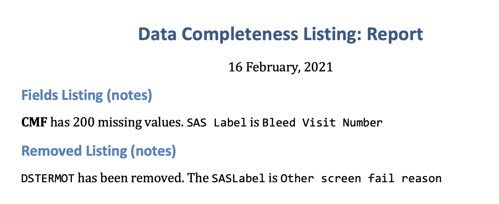

***

**Document Reference:** drs-complete-dashboard-word   
**Owner:** CSM   
**Issue date:** 2021-02-16   
**Version:** 1.10  

# Data Completeness Dashboard

This is a dashboard for the data completeness listing (see the example stored in the `docs/Fields_DataCompleteness_270302_20210110.xlsx` file). 

## Document History

Changes to this document should be listed in the `Change Log` section below:

### Change log 

**Version:**  
**Date:**   
**Description:**   
**Modified pages:**  

## Purpose

The purpose of this document is to serve as a guide to data scientists, app developers, system administrators, and data engineers who are responsible for the maintenance and deployment of the [**complete-dashboard**] dashboard/app. This document should give the reader all of the information necessary to build, test, and deploy the dashboard/app.

## Scope

The DRS document contains a complete description of the functionality of the [**complete-dashboard**] dashboard. It consists of use cases, functional requirements and non-functional requirements, which, taken together form a complete description of the software.

## Definitions, Acronyms and Abbreviations

**Term:** Listing  
**Definition:** output Excel file from SAS macro. In this dashboard, the listing is the `Fields_DataCompleteness_270302_YYYYMMDD.xlsx` file. This file contains three sheets: Run Date, Fields Listing, Removed Listing. 

**Term:**   
**Definition:**   

## References

### Applicable documents/inputs

The applicable documents/inputs are inputs to the dashboard/app. Any change to an applicable document or input is likely to impact the dashboard or app.

- File: Data Management Plan 
- Location: [Link to version 2.0](https://bmrn.sharepoint.com/:b:/r/sites/BIO/d/Cross-BMRN%20Including%20WuXi/Product%20eTMF/BMN-270/270-302/10.01%20Data%20Management%20Oversight/01%20Data%20Management%20Plan/270-302%20Data%20Management%20Plan%2009APR2020%20v2.0.pdf?csf=1&web=1&e=GlyGqy) 
- Version: [2.0-09-APR-2020]

### Applicable standards

R - [R reference standard](https://cran.r-project.org/manuals.html).  

### Reference documents

The reference documents are of interest to the reader of the DRS.

\clearpage 

# OVERALL DESCRIPTION

*This section describes the general factors that affect the dashboard/app and its requirements. This section does not state specific requirements. Instead, it provides an overview of those requirements, which are defined in detail in the 'REQUIREMENTS' section, and makes them easier to understand.*

The [**complete-dashboard**] dashboard displays the information contained in the `Fields_DataCompleteness_270302_YYYYMMDD` excel files, which are distributed via outlook to identified audiences. The `Fields_DataCompleteness_270302_YYYYMMDD` lists each dataset name, variable name, and a much more descriptive SAS label for each measurement. 

**Term:** `Dataset Name`  
**Description:** Name of source dataset. 

**Term:** `Field Name`  
**Description:** Abbreviated name for variable in dataset. 

**Term:** `SAS Label`    
**Description:** Plain language description of measurement  

It also contains counts for complete and missing data in the form of the following columns: 

**Term:** `Number of Records Expected Without Not Done`    
**Description:** *???*

**Term:** `# Data Present`   
**Description:** `# Data Present` / Total

**Term:** `Percentage of Data Present (%)`   
**Description:** `# Data Present` / Total

**Term:** `# Missing`    
**Description:** non-present values 

**Term:** `Percentage of Missing (%)`   
**Description:** `# Missing` / Total

**Term:** `Condition for Missing`   
**Description:** SAS code for missing values  

### Dashboard/app perspective

The figure below gives an overview of the high level data flow between the [**complete-dashboard**] dashboard and other files and components:

<!-- -->

### Dashboard/app functions  

The [**complete-dashboard**] dashboard will provide a tabular summary of the completed study measurements by dataset, field, and corresponding SAS label. Users will be able to view both the **Fields Listing** and **Removed Listing** sheets, take notes, and download a .pdf or .docx report. 

Objectives for using the dashboard include: 

1. Identifying the critical variables and datasets (version 1.1)

The critical variables were identified using the DMP (see Applicable documents section above). In section 7.2 (and table 7.2.1), a list of critical forms and fields are presented: 


|Form                        |Field                                          |RelatedEndpoint.Comment                                                                                                     |
|:---------------------------|:----------------------------------------------|:---------------------------------------------------------------------------------------------------------------------------|
|Adverse Events              |All                                            |Safety                                                                                                                      |
|Bleeding History            |All                                            |Number of Annualized bleeds experienced by the subject prior to dosing with BMRN270                                         |
|Bleeding Log                |All                                            |Number of annualized bleeds experienced by the subject after dosing.                                                        |
|Missed Work/School          |All                                            |There should be a Work/School form for every Bleeding log form completed                                                    |
|Factor VIII Infusions       |FVIII Dosing                                   |Number of doses of Historic prophylactic FVIII and the Number of FVIII required after administration of the study material. |
|Subject Disposition         |Date, reason                                   |Study disposition; study follow up time used to calculate annualized bleed rate/FVIII usage.                                |
|Study Drug Administration   |All                                            |Dose of study drug administered; follow up time used to calculate annualized bleed rate/FVIII usage.                        |
|External Lab Data (Covance) |FVIII levels and LFT all data to be reconciled |Safety and Efficacy                                                                                                         |

The critical variables are listed according to the `Form` they are contained in (**confirm critical datasets/variables!**). 

In version 1.1 the critical `Dataset Name`s are: 

1. `ECIF`    
2. `MHB`   
3. `CEB`   
4. `QSEM`   
5. `AE`  


2. Filtering to missing vs. non-missing  (version 1.1)

All fields with `# Missing` in `Fields_DataCompleteness_270302_YYYYMMDD` greater than `0` now have a `checkboxGroupInput()` for filtering out non-missing values.

3. Implementing rule-based/statistical methods to missing data (version ??)

### User characteristics  

The [**complete-dashboard**] dashboard will be made available on the [shiny server]. The target audience is:

- CDM decision makers
- Data Managers 
- [audience?]
- [audience?]

*Note on audience: we've discussed the *

### Constraints

The dashboard frontend shall be implemented using:

- SAS (calculations and summary report generation)  
- Excel (output file from SAS)  
- R (Excel file manipulation and shiny display)  

### Assumptions and dependencies

- R language (from [CRAN](https://cran.r-project.org/))  
- RStudio installed (from [RStudio](https://rstudio.com/))  
- Shiny server (from [RStudio](https://rstudio.com/products/shiny/shiny-server/), for deployment)

\clearpage 

# DASHBOARD/APP REQUIREMENTS

This section covers the specific requirements and design of the [**complete-dashboard**] dashboard. 

## Dashboard file (`complete-dashboard.Rmd`)

This file is located in the parent folder: 


```
## ..
## └── complete-dashboard.Rmd
```


## Inputs 

The downloadable reports also get loaded with the dashboard application into the shiny server: 


```
## ..
## ├── summary_report.Rmd
## └── summary_report_word.Rmd
```

The listing file is stored in the `data/` folder, and gets added to the YAML header under `resource_files:`

```yaml
title: "Data Completeness Report (v1.1)"
output:
  flexdashboard::flex_dashboard:
    orientation: rows
    theme: spacelab
    source_code: embed
runtime: shiny
resource_files:
- data/Fields_DataCompleteness_270302_20210110.xlsx
```

This folder will potentially contain any future listing (and can be updated with new Excel files).

## Dashboard/app overview

Below we describe some of the dashboard/application functions. 

### Mockup UI 

The initial landing page (Fields Listing) is below. 

<!-- -->

Filtered by critical variables 

<!-- -->

Filtered by missing variables 

<!-- -->

Filtered by critical and missing

<!-- -->

The Removed Listing page is below:

<!-- -->


### Mockup Server 

*in development*

The `server` side of this dashboard would contain a similar structure to the dashboard on shiny server: 


<!-- -->

### Use case overview

Example note for the **Fields listing** (version 1.0):

```MD
**CMF** has 200 missing values. 

`SAS Label` is `Bleed Visit Number`
```

<!-- -->

This works in the UI. 

Below is an example note for the **Removed listing**:

```MD
`DSTERMOT` has been removed. 

The `SASLabel` is `Other screen fail reason`
```

<!-- -->

When we click the PDF download file, we see 

<!-- -->

And below is the word output. 

<!-- -->

## Supplementary requirements

These are additional inputs, data files, or code that needs 

### Functional requirements

The [**complete-dashboard**] dashboard must be displayable by calling it through an URL. 

It must be possible to export the data from the [**complete-dashboard**] dashboard. 

The two .Rmd files for generating reports (`summary_report.Rmd` and `summary_report_word.Rmd`) must be loaded with the [**complete-dashboard**] dashboard.

### Non-functional requirements

Supported browsers: Internet Explorer 9, Firefox 4, Chrome 20, Edge.

### Security requirements

*in development*

\clearpage 

# APPENDIXES

## Logical data model

*in development*


